# 基于课堂视频的人脸自动考勤系统
## 说明

毕设报告还没过，先贴点图，过了再回来慢慢写23333。

如不想训练模型了，可以下载别人训练好的模型

> 
> 模型下载地址：百度网盘下载地址：链接: https://pan.baidu.com/s/1hAK9ylURkbeH52BtSSGWsw 提取码: jf1n 
> 
## 结果展示

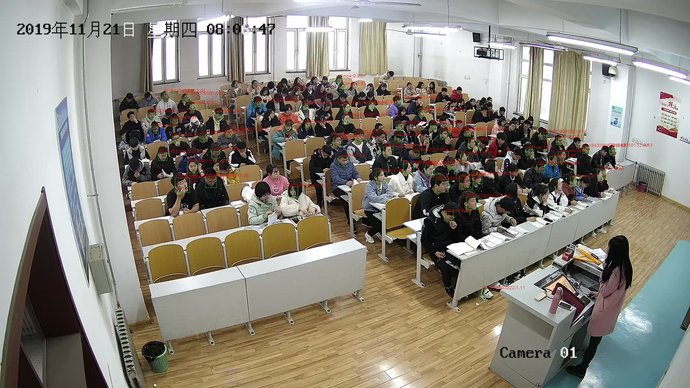

## 总体过程

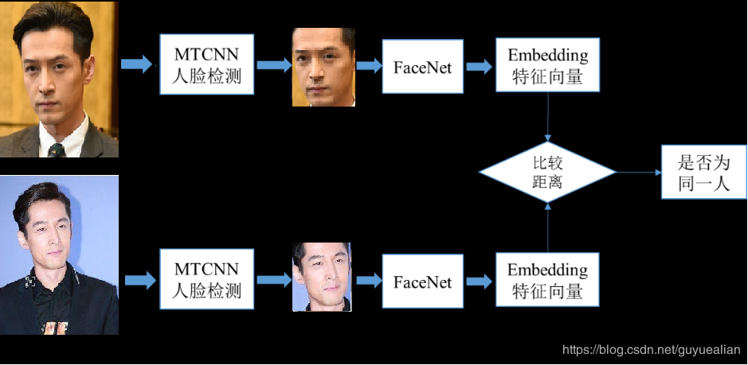

## MTCNN处理过程与网络结构

​			        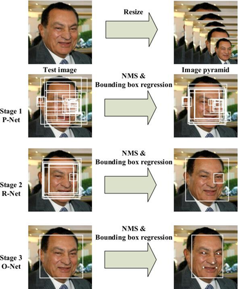							                     

​                  						 图2.1 MTCNN数据处理过程

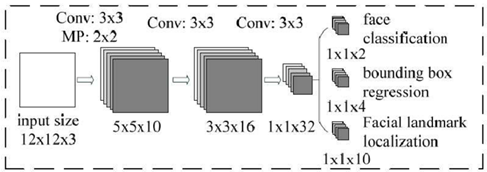

​												图2.2 P-Net网络结构图

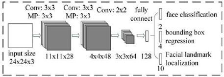

​													图2.3 R-Net网络结构图

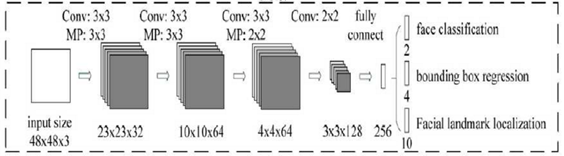

​                                                                   图2.4 O-Net网络结构图

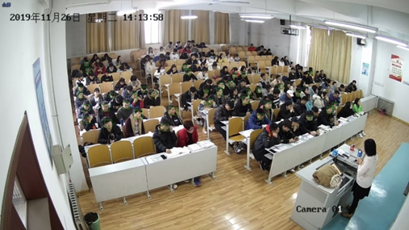

​															图2.11 MTCNN人脸检测测试结果

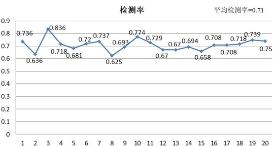

​																		图2.12 检测率折线图

## FaceNet处理过程与网络结构

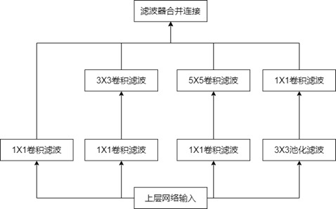

​																		图3.2 Inception结构图

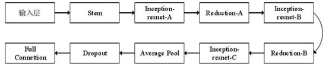

​																		图3.2 Inception-resnet-v1结构图

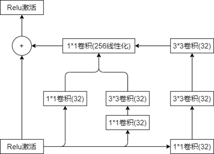

​																		图3.3 Inception-resnet-A结构图

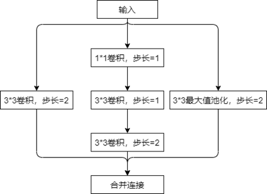

​																		图3.4 Reduction-A结构图

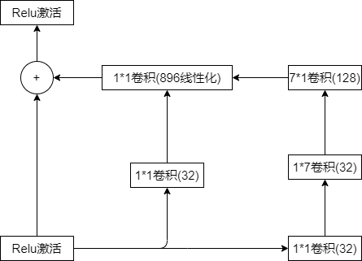

​																	图3.5 Inception-resnet-B结构图

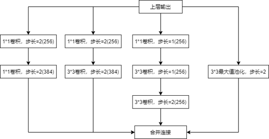

​																				图3.6 Reduction-B结构图

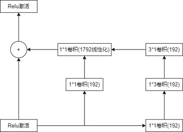

​																	图3.7 Inception-resnet-C结构图

​																		图3.8 三元损失目标函数实验过程

## 系统相关

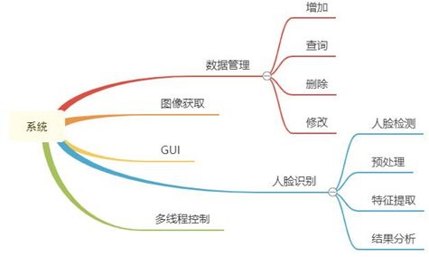

​																			图4.2 系统模块框架图

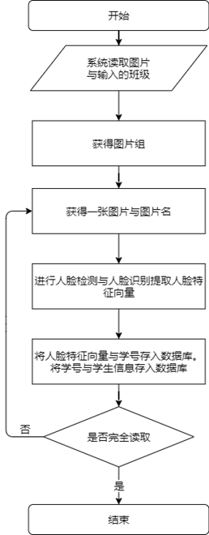

​																图4.3 人脸数据库的数据处理流程	

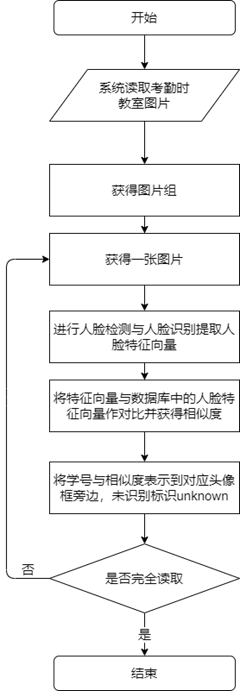

​																		图4.4 考勤数据处理流程图

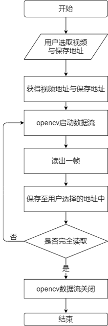

​																					图4.5 图像处理流程图

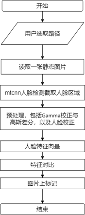

​																				图4.6 人脸识别流程图

## 数据库设计

表4.1 用户信息表

| 表名       | 字段  | 类型        | 说明     |
| ---------- | ----- | ----------- | -------- |
| admin_info | acc   | varchar(20) | 用户账户 |
|            | pass  | varchar(20) | 用户密码 |
|            | power | varchar(20) | 权限等级 |

表4.2课程信息表

| 表名       | 字段                | 类型        | 说明         |
| ---------- | ------------------- | ----------- | ------------ |
| class_info | class_id            | varchar(20) | 课程编号     |
|            | class_class         | varchar(20) | 上课班级     |
|            | class_teacher_name  | varchar(20) | 任课教师姓名 |
|            | class_teacher_email | varchar(50) | 任课教师邮箱 |

表4.3学生表

| 表名    | 字段       | 类型  | 说明          |
| ------- | ---------- | ----- | ------------- |
| student | student_no | int   | 学号          |
|         | e_0        | float | 特征向量第1维 |
|         | e_1        | float | 特征向量第2维 |
|         | e_2        | float | 特征向量第3维 |
|         | e_5        | float | 特征向量第4维 |
|         | e_8        | float | 特征向量第7维 |
|         | ···        | ···   | ····          |
|         | e_509      | float | 特征向量510维 |
|         | e_510      | float | 特征向量511维 |
|         | e_511      | float | 特征向量512维 |

 

表4.4学生信息表

| 表名         | 字段              | 类型        | 说明         |
| ------------ | ----------------- | ----------- | ------------ |
| student_info | student_no        | int         | 学号         |
|              | student_class     | varchar(20) | 班级         |
|              | num_of_attendance | int         | 应出勤次数   |
|              | act_of_attendance | int         | 实际出勤次数 |

 

## 功能流程图

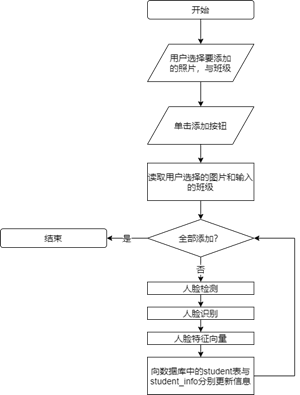

​																			图4.11 添加学生信息流程图

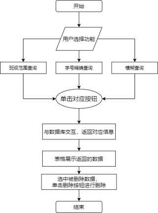

​																	图4.13 学生信息查询删除流程图

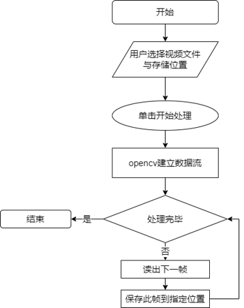

​																						图4.15预处理流程图

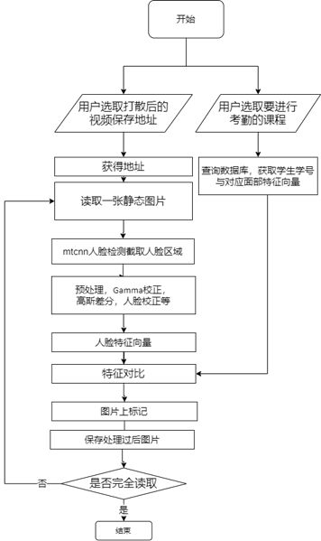

​																		图4.17自动考勤流程